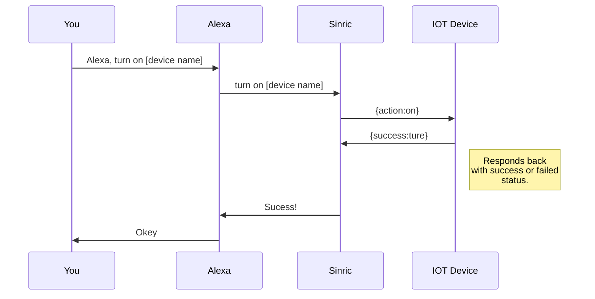
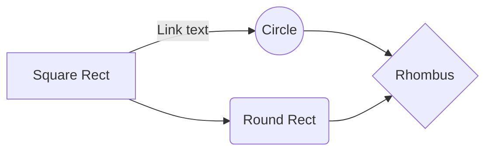

# Welcome to Sinric Pro Help!

Welcome to **Sinric Pro** device documentation.

**API**

 - Complete API documentation is available [here](https://apidocs.sinric.pro/)

**SDKs**

 - ESP8266/ESP32 SDK
 - Python SDK
 - NodeJS SDK

# Supported devices

Following device types are supported at the moment
 - [Smart Light Bulb](devices/Smart%20Light%20Bulb.md)
 - [Smart Switch](devices/Smart%20Switch.md)
 - [Smart Switch with Dimmer](devices/Smart%20Switch%20with%20Dimmer.md)
 - [Doorbell](devices/Doorbell.md)
 - [Temperature Sensor](devices/Temperature%20Sensor.md)
 - [Window AC Unit](devices/Window%20AC%20Unit.md)
 - [Fan](devices/Fan.md)
 - [Motion Sensor](devices/Motion%20Sensor.md)
 - [Contact Sensor](devices/Contact%20Sensor.md)
 - [Thermostat](devices/Thermostat.md)
 - [TV](devices/TV.md)
 - [Smart Speaker](devices/Smart%20Light%20Bulb.md)
 - [Smart Lock](devices/Smart%20Light%20Bulb.md)
 - [Door](devices/Door.md)
 

## Tutorials

 - How to make a doorbell
 
	> Before starting to sync files, you must link an account in the **Synchronize** sub-menu.

## Open a file

You can open a file from **Google Drive**, **Dropbox** or **GitHub** by opening the **Synchronize** sub-menu and clicking **Open from**. Once opened in the workspace, any modification in the file will be automatically synced.

## Save a file

You can save any file of the workspace to **Google Drive**, **Dropbox** or **GitHub** by opening the **Synchronize** sub-menu and clicking **Save on**. Even if a file in the workspace is already synced, you can save it to another location. StackEdit can sync one file with multiple locations and accounts.

## Synchronize a file

Once your file is linked to a synchronized location, StackEdit will periodically synchronize it by downloading/uploading any modification. A merge will be performed if necessary and conflicts will be resolved.

If you just have modified your file and you want to force syncing, click the **Synchronize now** button in the navigation bar.

> **Note:** The **Synchronize now** button is disabled if you have no file to synchronize.

## Manage file synchronization

Since one file can be synced with multiple locations, you can list and manage synchronized locations by clicking **File synchronization** in the **Synchronize** sub-menu. This allows you to list and remove synchronized locations that are linked to your file.

# Publication

Publishing in StackEdit makes it simple for you to publish online your files. Once you're happy with a file, you can publish it to different hosting platforms like **Blogger**, **Dropbox**, **Gist**, **GitHub**, **Google Drive**, **WordPress** and **Zendesk**. With [Handlebars templates](http://handlebarsjs.com/), you have full control over what you export.

> Before starting to publish, you must link an account in the **Publish** sub-menu.

## Publish a File

You can publish your file by opening the **Publish** sub-menu and by clicking **Publish to**. For some locations, you can choose between the following formats:

- Markdown: publish the Markdown text on a website that can interpret it (**GitHub** for instance),
- HTML: publish the file converted to HTML via a Handlebars template (on a blog for example).

## Update a publication

After publishing, StackEdit keeps your file linked to that publication which makes it easy for you to re-publish it. Once you have modified your file and you want to update your publication, click on the **Publish now** button in the navigation bar.

> **Note:** The **Publish now** button is disabled if your file has not been published yet.

## Manage file publication

Since one file can be published to multiple locations, you can list and manage publish locations by clicking **File publication** in the **Publish** sub-menu. This allows you to list and remove publication locations that are linked to your file.

# Markdown extensions

StackEdit extends the standard Markdown syntax by adding extra **Markdown extensions**, providing you with some nice features.

> **ProTip:** You can disable any **Markdown extension** in the **File properties** dialog.

## CompleyActions and events list

Following devices are using actions:

|                |Action |Event| 
|----------------|------|---------|------|
|**Smart Switch** | setPowerState | setPowerState 
|**Smart Light Bulb**  |setPowerState, adjustBrightness, setBrightness, setColor, decreaseColorTemperature, increaseColorTemperature, setColorTemperature, setPowerLevel, adjustPowerLevel|setPowerState, setPowerLevel, setColor, setColorTemperature          
|**Smart Switch with Dimmer**|setPowerState, setPowerLevel adjustPowerLevel|setPowerState, setPowerLevel|
|**Doorbell**| setPowerState|DoorbellPress, setPowerState|
|**Temperature Sensor** |setPowerState|setPowerState, currentTemperature|
|**Thermostat**|setPowerState,targetTemperature, setThermostatMode|setPowerState, targetTemperature, setThermostatMode, currentTemperature|
|**Window AC Unit**|setPowerState, targetTemperature, setThermostatMode, setRangeValue, adjustRangeValue|setPowerState, targetTemperature, setThermostatMode, setRangeValue, currentTemperature|
|**Fan**|setPowerState, setRangeValue|setPowerState, setRangeValue|
|**Motion Sensor**|setPowerState|setPowerState, motion|
|**Contact Sensor**|setPowerState|setPowerState, setContactState|
|**TV**|setPowerState, setVolume, adjustVolume, setMute, mediaControl, selectInput, changeChannel, skipChannels|setPowerState, setVolume, setMute, mediaControl, selectInput, changeChannel, skipChannels|
|**Smart Speaker**|setPowerState, setVolume, adjustVolume, setMute, mediaControl, setBands, adjustBands, resetBands, setMode|setPowerState, setVolume, setMute, mediaControl, setBands, resetBands, setMode|
|**Smart Doorlock**|setLockState|setLockState 

## KaTeX

You can render LaTeX mathematical expressions using [KaTeX](https://khan.github.io/KaTeX/):

The *Gamma function* satisfying $\Gamma(n) = (n-1)!\quad\forall n\in\mathbb N$ is via the Euler integral

$$
\Gamma(z) = \int_0^\infty t^{z-1}e^{-t}dt\,.
$$

> You can find more information about **LaTeX** mathematical expressions [here](http://meta.math.stackexchange.com/questions/5020/mathjax-basic-tutorial-and-quick-reference).

## UML diagrams

You can render UML diagrams using [Mermaid](https://mermaidjs.github.io/). For example, this will produce a sequence diagram:

And this will produce a flow chart:

<!--stackedit_data:
eyJoaXN0b3J5IjpbLTE4NDcxMDY0MzAsMTU3NTMyMjU1NSwtMT
U3MDAwNDIzMiwyMDY1NTg3OTI5LDEyNTA4NTEzMDVdfQ==
-->