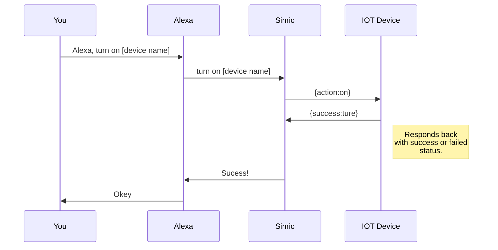
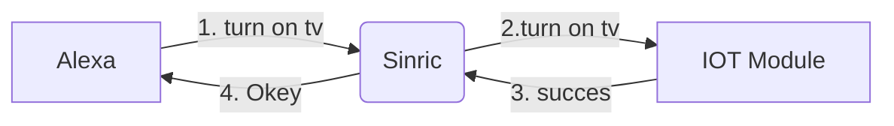

# Messages

There are 3 types of messages in Sinric

 1. Request
 2. Respond
 3. Event

An act of doing something in Sinric system will generate a **request** action. eg: turn on a tv using Alexa. When you receive a request in your IOT module, you must respond to it by sending an **response** action. So the server can update the interested parties about the status of the **request** they made.

Interacting with a device physically or making a change in the device will raise an **event**. for an example: pushing a button to turn on/off a device may raise an setPowerState event to notify the server

## Complete actions and events list

|                |Action |Event| 
|----------------|------|---------|------|
|**Smart Switch** | setPowerState | setPowerState 
|**Smart Light Bulb**  |setPowerState, adjustBrightness, setBrightness, setColor, decreaseColorTemperature, increaseColorTemperature, setColorTemperature, setPowerLevel, adjustPowerLevel|setPowerState, setPowerLevel, setColor, setColorTemperature          
|**Smart Switch with Dimmer**|setPowerState, setPowerLevel adjustPowerLevel|setPowerState, setPowerLevel|
|**Doorbell**| setPowerState|DoorbellPress, setPowerState|
|**Temperature Sensor** |setPowerState|setPowerState, currentTemperature|
|**Thermostat**|setPowerState,targetTemperature, setThermostatMode|setPowerState, targetTemperature, setThermostatMode, currentTemperature|
|**Window AC Unit**|setPowerState, targetTemperature, setThermostatMode, setRangeValue, adjustRangeValue|setPowerState, targetTemperature, setThermostatMode, setRangeValue, currentTemperature|
|**Fan**|setPowerState, setRangeValue|setPowerState, setRangeValue|
|**Motion Sensor**|setPowerState|setPowerState, motion|
|**Contact Sensor**|setPowerState|setPowerState, setContactState|
|**TV**|setPowerState, setVolume, adjustVolume, setMute, mediaControl, selectInput, changeChannel, skipChannels|setPowerState, setVolume, setMute, mediaControl, selectInput, changeChannel, skipChannels|
|**Smart Speaker**|setPowerState, setVolume, adjustVolume, setMute, mediaControl, setBands, adjustBands, resetBands, setMode|setPowerState, setVolume, setMute, mediaControl, setBands, resetBands, setMode|
|**Smart Doorlock**|setLockState|setLockState 

 

## UML diagrams

You can render UML diagrams using [Mermaid](https://mermaidjs.github.io/). For example, this will produce a sequence diagram:

How an request / response works:

> Written with [StackEdit](https://stackedit.io/).
<!--stackedit_data:
eyJoaXN0b3J5IjpbNjQyNDU1NDM4XX0=
-->