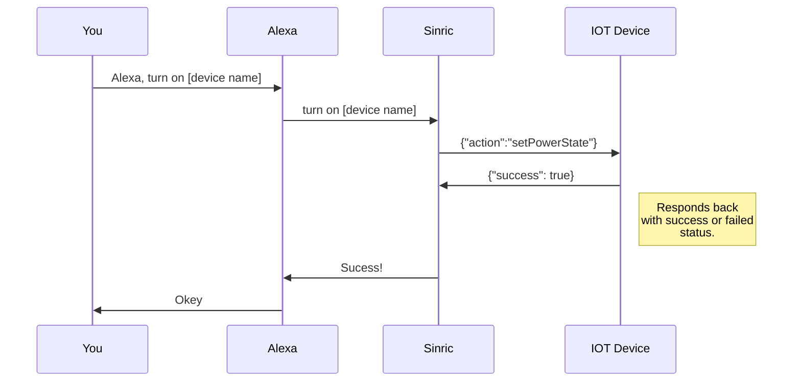
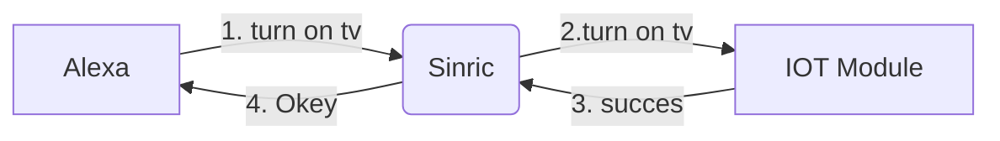
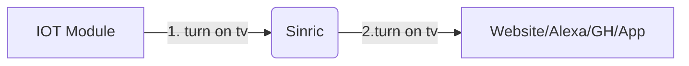

## UML diagram

```mermaid
sequenceDiagram
You ->> Alexa: Alexa, turn on [device name]
Alexa->>Sinric: turn on [device name]
Sinric->>IOT Device: {"action":"setPowerState"}
IOT Device->>Sinric: {"success": true}
Note right of IOT Device: Responds back <br/>with success or failed <br/>status.
Sinric->> Alexa : Sucess!
Alexa->> You : Okey
```

How an request / response works:

```mermaid
graph LR
A[Alexa] -- 1. turn on tv --> B(Sinric)
B -- 2.turn on tv --> D[IOT Module]
D -- 3. succes --> B
B -- 4. Okey -->A
```

How an event works:

```mermaid
graph LR
A[IOT Module] -- 1. turn on tv --> B(Sinric)
B -- 2.turn on tv --> D[Website/Alexa/GH/App]
```
> Written with [StackEdit](https://stackedit.io/).
<!--stackedit_data:
eyJoaXN0b3J5IjpbMTgzODU1ODE5M119
-->