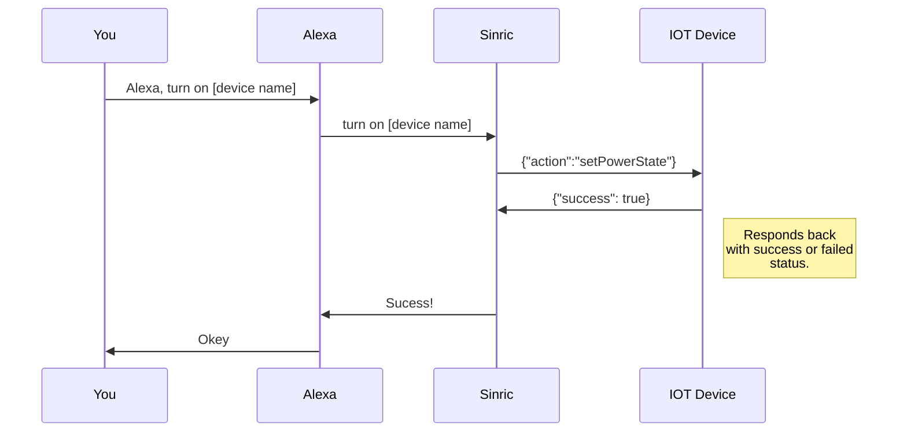

## How Amazon Alexa works with Sinric Pro

### Request
1.  The Alexa sends a message to the Sinric IOT Platform.
2.  The Sinric IOT Platform creates a request message and forward it to your IOT module.
3. Your IOT module responds back to the Sinric IOT Platform.
4. The Sinric IOT Platform update the device status according to your response and updates Alexa service.

More simplified :

### Event

Sinric IOT platform will report any changes to Alexa as well. 

1.  The user change the device state physically. (eg: push a button).
2.  Your IOT module creates an event message and send it to Sinric IOT Platform.
3.  The Sinric IOT platform update the device status and update Alexa service

<!--stackedit_data:
eyJoaXN0b3J5IjpbLTE1OTE1NTAzMDcsLTU1MjQ3MjI5OSwxOD
M4NTU4MTkzXX0=
-->