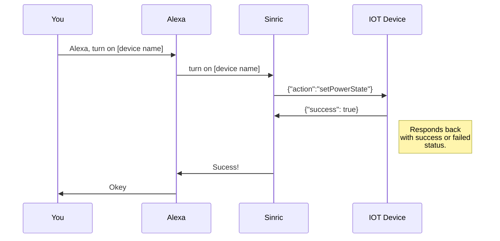
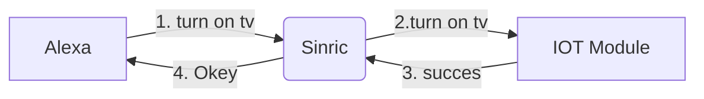
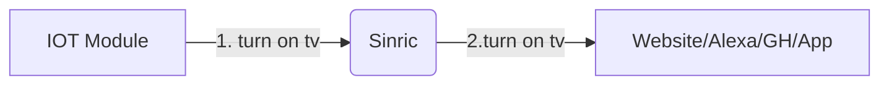

# Commnuication Protocol
There are 3 types of messages in Sinric Pro

 1. Request
 2. Respond
 3. Event

## Request
An act of doing something in Sinric IOT platform will generate a **request** type message. Eg: Alexa, turn on [device name]. will generate a request message like this 
```
{
 "payloadVersion": 1,
 "clientId": "alexa-skill",
 "messageId" : "c71d3cca-180a-49b0-83ca-f5d9f0aef242",
 "createdAt": 1561476448,
 "deviceId": "5099803df3f4948bd2f98391",
 "deviceAttributes": "",
 "type": "request",
 "action": "setPowerState",
 "value": {
   "state": "On"
  }
}
```
[https://github.com/sinricpro/sample_messages/blob/master/01_PowerState/01_setPowerState/01_Request.json](https://github.com/sinricpro/sample_messages/blob/master/01_PowerState/01_setPowerState/01_Request.json)

## Response
 When you receive such a request in your IOT module, you must respond to it by sending a **response** type message. The correct response to above request should be
```
{
 "payloadVersion": 1,
 "success": true,
 "message": "OK",
 "createdAt": 1561476448,
 "deviceId": "5099803df3f4948bd2f98391",
 "clientId": "alexa-skill",
 "messageId" : "c71d3cca-180a-49b0-83ca-f5d9f0aef242",
 "type": "response",
 "action": "setPowerState",
 "value": {
     "state": "On"
  }
}
```
[https://github.com/sinricpro/sample_messages/blob/master/01_PowerState/01_setPowerState/02_Response.json](https://github.com/sinricpro/sample_messages/blob/master/01_PowerState/01_setPowerState/02_Response.json)

Notes:
* "messageId" field must be the message id in the **request**
* "createdAt" timestamp is Unix time in seconds
* If you are using the SDK, the response will be handled by the SDK internally

Upon receiving this response in the server, the server will update the interested parties about the status of the **request** they made.

## Event
Let's imagine you want to turn on the device by pushing a button. in that case, you are interacting with a device physically or making a change to the device manually. So you should raise an **event** to let the server know about this change. 
``` 
{
 "payloadVersion": 1,
 "createdAt": 1561476448,
 "messageId": "fca894e9-9c47-4447-9313-be4475508a8d",
 "deviceId": "5099803df3f4948bd2f98391",
 "type": "event",
 "action": "setPowerState",
 "value": {
  "state": "On"
 },
 "cause": {
  "type": "PHYSICAL_INTERACTION"
 }
}
```

## UML diagram



How an request / response works:



How an event works:



## Complete actions and events list

|                |Action |Event| 
|----------------|------|---------|------|
|**Smart Switch** | setPowerState | setPowerState 
|**Smart Light Bulb**  |setPowerState, adjustBrightness, setBrightness, setColor, decreaseColorTemperature, increaseColorTemperature, setColorTemperature, setPowerLevel, adjustPowerLevel|setPowerState, setPowerLevel, setColor, setColorTemperature|          
|**Smart Switch with Dimmer**|setPowerState, setPowerLevel adjustPowerLevel|setPowerState, setPowerLevel|
|**Doorbell**| setPowerState|DoorbellPress, setPowerState|
|**Temperature Sensor** |setPowerState|setPowerState, currentTemperature|
|**Thermostat**|setPowerState,targetTemperature, setThermostatMode|setPowerState, targetTemperature, setThermostatMode, currentTemperature|
|**Window AC Unit**|setPowerState, targetTemperature, setThermostatMode, setRangeValue, adjustRangeValue|setPowerState, targetTemperature, setThermostatMode, setRangeValue, currentTemperature|
|**Fan**|setPowerState, setRangeValue|setPowerState, setRangeValue|
|**Motion Sensor**|setPowerState|setPowerState, motion|
|**Contact Sensor**|setPowerState|setPowerState, setContactState|
|**TV**|setPowerState, setVolume, adjustVolume, setMute, mediaControl, selectInput, changeChannel, skipChannels|setPowerState, setVolume, setMute, mediaControl, selectInput, changeChannel, skipChannels|
|**Smart Speaker**|setPowerState, setVolume, adjustVolume, setMute, mediaControl, setBands, adjustBands, resetBands, setMode|setPowerState, setVolume, setMute, mediaControl, setBands, resetBands, setMode|
|**Smart Doorlock**|setLockState|setLockState| 

 


> Written with [StackEdit](https://stackedit.io/).
<!--stackedit_data:
eyJoaXN0b3J5IjpbMTc5OTY4NzY5MF19
-->